# HyperShift / Hosted Control Planes (HCP) - Onboarding Guide

!!! note "How this guide relates to other docs"
    This is a **curated learning path** — it provides a structured narrative to help newcomers build a mental model of HyperShift step by step. It intentionally summarizes topics that are covered in more detail in dedicated reference pages. Where applicable, "See also" links point you to the authoritative source for deeper reading. This guide is not a replacement for those docs.

---

## Table of Contents

1. [What is HyperShift?](#1-what-is-hypershift)
2. [Key Concepts](#2-key-concepts)
3. [Overall Architecture](#3-overall-architecture)
4. [Main Components](#4-main-components)
5. [HostedCluster Lifecycle](#5-hostedcluster-lifecycle)
6. [Control Plane in Detail](#6-control-plane-in-detail)
7. [Data Plane and Node Management](#7-data-plane-and-node-management)
8. [Supported Cloud Platforms](#8-supported-cloud-platforms)
9. [APIs and Code Structure](#9-apis-and-code-structure)
10. [Development Workflow](#10-development-workflow)
11. [Common Development Patterns](#11-common-development-patterns)
12. [Architectural Invariants](#12-architectural-invariants)
13. [Key File Reference](#13-key-file-reference)
14. [Recommended Learning Path](#14-recommended-learning-path)

---

## 1. What is HyperShift?

HyperShift is an OpenShift middleware that **decouples the control plane from the data plane** (worker nodes), allowing control planes to run as workloads on a central **management cluster**.

### The Problem it Solves

In standalone OpenShift, every cluster runs its own control plane (etcd, kube-apiserver, controllers) on dedicated master nodes. This creates:

- **Resource overhead**: 3+ master nodes per cluster just for the control plane
- **Provisioning time**: 30-45 minutes including bootstrap
- **Distributed operations**: each control plane is independently operated

### How HyperShift Solves It

**Standalone OpenShift** — each cluster embeds its own control plane on dedicated master nodes:

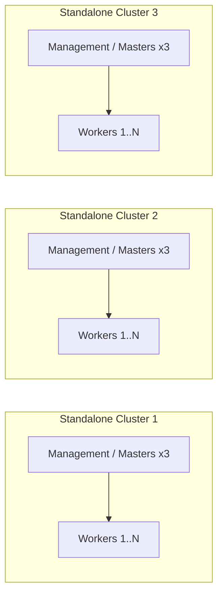

**HyperShift Model** — a single management cluster hosts all control planes as pods:

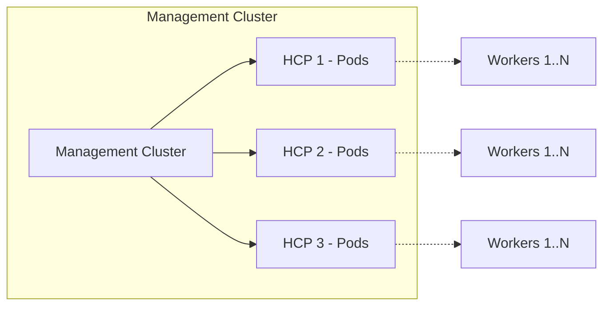

| Aspect | Standalone OpenShift | HyperShift (HCP) |
|--------|---------------------|-------------------|
| Control plane location | Dedicated master nodes inside the cluster | Pods on a management cluster |
| Master nodes | 3+ required | Zero; only worker nodes in the guest cluster |
| Provisioning time | 30-45 minutes | ~10-15 minutes |
| Control plane isolation | Physical/VM | Namespace + NetworkPolicies |
| Upgrade model | Single upgrade for CP + workers | Independent upgrades for CP vs data plane |

---

## 2. Key Concepts

> **See also**: [Concepts and Personas](../reference/concepts-and-personas.md) for detailed persona definitions (Service Provider, Consumer, Instance Admin) and [Controller Architecture](../reference/controller-architecture.md) for detailed controller diagrams and resource dependency graphs.

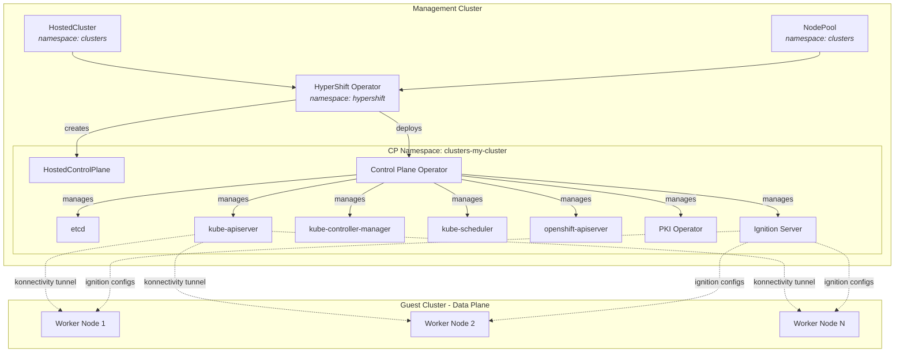

### Glossary

> For full persona and concept definitions, see [Concepts and Personas](../reference/concepts-and-personas.md).

| Term | Description | Start Reading Here |
|------|-------------|-------------------|
| **Management Cluster** | The OpenShift/K8s cluster where HyperShift operators run and where control plane pods live | `hypershift-operator/main.go` |
| **Guest Cluster** (Hosted Cluster) | The cluster end users consume. Only has worker nodes | - |
| **HostedCluster (HC)** | User-facing CRD declaring the intent to create a cluster. Lives in the user's namespace | `api/hypershift/v1beta1/hostedcluster_types.go` |
| **HostedControlPlane (HCP)** | Internal CRD created by the HC controller. Lives in the control plane namespace. The CPO reads it to know what to deploy | `api/hypershift/v1beta1/hosted_controlplane.go` |
| **NodePool (NP)** | User-facing CRD defining a scalable set of worker nodes. References a HostedCluster | `api/hypershift/v1beta1/nodepool_types.go` |
| **Control Plane Namespace** | Auto-created namespace (`{hc-ns}-{hc-name}`) where all control plane components live | `hypershift-operator/controllers/manifests/manifests.go` |
| **HyperShift Operator (HO)** | Main operator managing HostedClusters and NodePools | `hypershift-operator/controllers/hostedcluster/hostedcluster_controller.go` |
| **Control Plane Operator (CPO)** | Runs inside each CP namespace and manages all control plane components | `control-plane-operator/controllers/hostedcontrolplane/hostedcontrolplane_controller.go` |
| **PKI Operator** | Certificate operator handling rotation and signing | `control-plane-pki-operator/operator.go` |
| **Ignition Server** | HTTPS server that serves ignition configs to worker nodes during bootstrap | `ignition-server/cmd/start.go` |

---

## 3. Overall Architecture

> **See also**: [Controller Architecture](../reference/controller-architecture.md) for detailed controller diagrams and resource dependency graphs.

```mermaid
graph TB
    subgraph "Management Cluster"
        subgraph "hypershift namespace"
            HO_DEPLOY[hypershift-operator<br/>Deployment]
        end

        subgraph "clusters namespace - User Facing"
            HC1[HostedCluster<br/>my-cluster]
            NP1[NodePool<br/>my-cluster-workers]
            NP2[NodePool<br/>my-cluster-infra]
            KC_SECRET[kubeconfig Secret]
            PWD_SECRET[kubeadmin-password Secret]
        end

        subgraph "clusters-my-cluster namespace - Control Plane"
            HCP1[HostedControlPlane]

            subgraph "Deployed by the CPO"
                ETCD1[etcd StatefulSet]
                KAS1[kube-apiserver]
                KCM1[kube-controller-manager]
                SCHED1[kube-scheduler]
                OAPI1[openshift-apiserver]
                OAUTH1[oauth-server]
                CVO1[cluster-version-operator]
                CNO1[cluster-network-operator]
                CCM1[cloud-controller-manager]
                KONN[konnectivity-server]
                IGN1[ignition-server]
                MORE1["+30 more components..."]
            end

            CPO1[control-plane-operator]
            PKI1[control-plane-pki-operator]
            CAPI_MGR[CAPI Manager]
            CAPI_PROV[CAPI Provider]
        end
    end

    subgraph "Guest Cluster - Workers Only"
        KUBELET1[kubelet]
        KONN_AGENT[konnectivity-agent]
        CNI[OVN/SDN agents]
        WORKLOADS[User Workloads]
    end

    HO_DEPLOY -->|watch/reconcile| HC1
    HO_DEPLOY -->|watch/reconcile| NP1
    HO_DEPLOY -->|watch/reconcile| NP2
    HO_DEPLOY -->|creates namespace + resources| HCP1
    HO_DEPLOY -->|deploys| CPO1

    CPO1 -->|reconciles HCP| ETCD1
    CPO1 --> KAS1
    CPO1 --> KCM1

    KONN -->|tunnel| KONN_AGENT
    KAS1 -->|API calls via tunnel| KUBELET1
```

### Namespace Layout

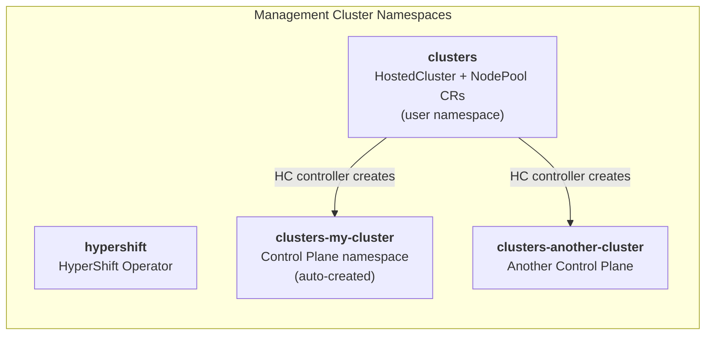

The namespace naming convention is implemented in `hypershift-operator/controllers/manifests/manifests.go`:
```go
func HostedControlPlaneNamespace(hostedClusterNamespace, hostedClusterName string) string {
    return fmt.Sprintf("%s-%s", hostedClusterNamespace, strings.ReplaceAll(hostedClusterName, ".", "-"))
}
```

> **Explore yourself**: Read `hypershift-operator/controllers/manifests/manifests.go` to see all the naming helpers used across the codebase.

---

## 4. Main Components

> **See also**: [Controller Architecture](../reference/controller-architecture.md) for detailed controller diagrams, resource dependency graphs, and the Hosted Cluster Config Operator.

### 4.1 HyperShift Operator (HO)

- **Entry point**: `hypershift-operator/main.go`
- **Deployed in**: `hypershift` namespace as a Deployment

Contains the main controllers:

| Controller | Directory | Function | Read This First |
|------------|-----------|----------|-----------------|
| **HostedCluster** | `hypershift-operator/controllers/hostedcluster/` | Manages full HC lifecycle, creates CP namespace, deploys CPO | `hostedcluster_controller.go` (start at `Reconcile` method, ~line 337) |
| **NodePool** | `hypershift-operator/controllers/nodepool/` | Manages CAPI Machines, ignition tokens, rolling upgrades | `nodepool_controller.go` (start at `Reconcile` method) |
| **HostedClusterSizing** | `hypershift-operator/controllers/hostedclustersizing/` | Resource-based sizing decisions | `hostedclustersizing_controller.go` |
| **Scheduler** | `hypershift-operator/controllers/scheduler/` | Schedules HCs on management cluster nodes | `scheduler.go` |
| **SharedIngress** | `hypershift-operator/controllers/sharedingress/` | Shared ingress across multiple HCs | `sharedingress_controller.go` |

> **Explore yourself**: The HostedCluster controller (`hostedcluster_controller.go`) is ~5200 lines. Don't try to read it all at once. Start with the `Reconcile` method and follow the function calls. Key sub-functions to look at:
>
> - `reconcileHostedControlPlane()` (~line 2404) - how HC spec is translated to HCP
> - `reconcileControlPlaneOperator()` - how the CPO deployment is created
> - `reconcileCAPICluster()` (~line 2901) - how the CAPI Cluster CR is created
> - `r.delete()` (~line 501) - the deletion flow

### 4.2 Control Plane Operator (CPO)

- **Source**: `control-plane-operator/`
- **Main controller**: `control-plane-operator/controllers/hostedcontrolplane/hostedcontrolplane_controller.go` (~3200 lines)
- **Deployed in**: each CP namespace (one CPO instance per hosted cluster)

The CPO reads the `HostedControlPlane` resource and reconciles ~40 control plane components:

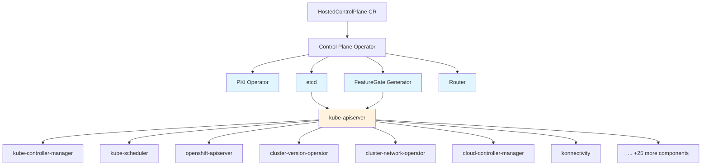

> Light blue components have no KAS dependency. KAS (orange) is an implicit dependency for everything else. The full list includes oauth-server, oauth-apiserver, openshift-controller-manager, ingress-operator, dns-operator, machine-approver, config-operator, storage-operator, node-tuning-operator, and more.
> **Explore yourself**: Look at the `registerComponents()` function (~line 236 in `hostedcontrolplane_controller.go`) to see the full list of registered components. Then pick one simple component like `kube-scheduler` at `control-plane-operator/controllers/hostedcontrolplane/v2/kube_scheduler/` to understand the pattern.

### 4.3 CPOv2 Framework

The declarative framework for defining control plane components. Each component uses a builder pattern:

```go
component.NewDeploymentComponent(name, opts).
    WithAdaptFunction(adaptDeployment).           // Dynamic deployment mutations
    WithPredicate(predicate).                      // Enable/disable the component
    WithDependencies("etcd", "featuregate-generator"). // Block until deps are ready
    WithManifestAdapter("config.yaml", ...).       // Adapt supporting manifests
    InjectTokenMinterContainer(tokenOpts).         // Auto-inject token minter sidecar
    InjectKonnectivityContainer(konnOpts).         // Auto-inject konnectivity proxy
    RolloutOnConfigMapChange("my-config").          // Auto-rollout on config change
    Build()
```

| File | What it does | Why you should read it |
|------|-------------|----------------------|
| `support/controlplane-component/controlplane-component.go` | Core reconcile logic, `ControlPlaneComponent` interface | Understand how components are reconciled (line 163, `Reconcile` method) |
| `support/controlplane-component/builder.go` | Builder pattern for constructing components | Learn how to create a new component |
| `support/controlplane-component/status.go` | Dependency checking, status conditions | Understand `checkDependencies` (line 50) and how `Available`/`RolloutComplete` conditions work |
| `support/controlplane-component/workload.go` | Workload (Deployment/StatefulSet) reconciliation | See how deployments are created from asset manifests |

Each component generates a `ControlPlaneComponent` CR with conditions:

- `ControlPlaneComponentAvailable` - at least one pod is ready
- `ControlPlaneComponentRolloutComplete` - all pods at the desired version

> **Explore yourself**: Compare a simple component (`v2/kube_scheduler/`) with a complex one (`v2/kas/`) to see how the framework scales. Assets (YAML manifests) live in `v2/assets/<component>/`.

### 4.4 PKI Operator

**Directory**: `control-plane-pki-operator/`

Manages all PKI (certificates) for the hosted cluster:

| Controller | Directory | Function |
|------------|-----------|----------|
| CertRotation | `certrotationcontroller/` | Rotates CAs and leaf certs using library-go |
| CertificateSigning | `certificatesigningcontroller/` | Signs CSRs for break-glass access |
| CSR Approval | `certificatesigningrequestapprovalcontroller/` | Auto-approves CSRs matching known signers |
| CertRevocation | `certificaterevocationcontroller/` | Handles certificate revocation |
| TargetConfig | `targetconfigcontroller/` | PKI target configuration |

Supports two break-glass signers: **Customer** and **SRE**.

> **Explore yourself**: Start with `control-plane-pki-operator/operator.go` to see how all sub-controllers are wired together. Then look at `certificates/` for signer definitions.

### 4.5 Ignition Server

**Directory**: `ignition-server/`

HTTPS server serving ignition configs to worker nodes during bootstrap:

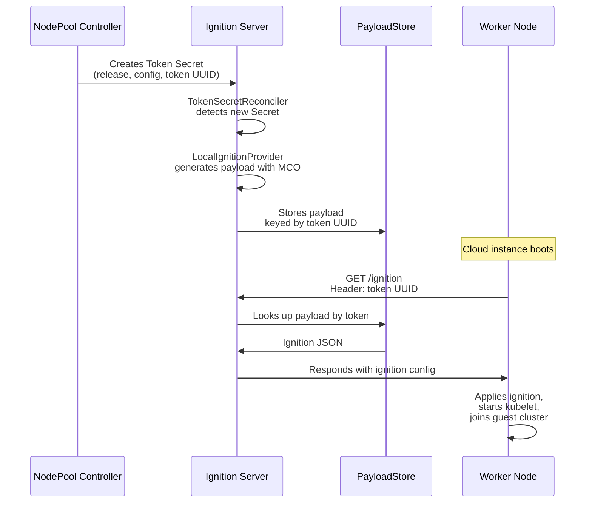

| File | What it does |
|------|-------------|
| `ignition-server/cmd/start.go` | HTTPS server setup, `/ignition` request handler |
| `ignition-server/controllers/tokensecret_controller.go` | `TokenSecretReconciler`: watches token Secrets, generates payloads, rotates tokens |
| `ignition-server/controllers/local_ignitionprovider.go` | `LocalIgnitionProvider`: extracts MCO binaries from release image, runs them to produce ignition JSON |
| `ignition-server/controllers/cache.go` | `ExpiringCache`: in-memory TTL cache for payloads |

> **Explore yourself**: Start with `ignition-server/cmd/start.go` to understand the HTTP handler, then follow the flow into `tokensecret_controller.go`.

---

## 5. HostedCluster Lifecycle

### 5.1 Creation

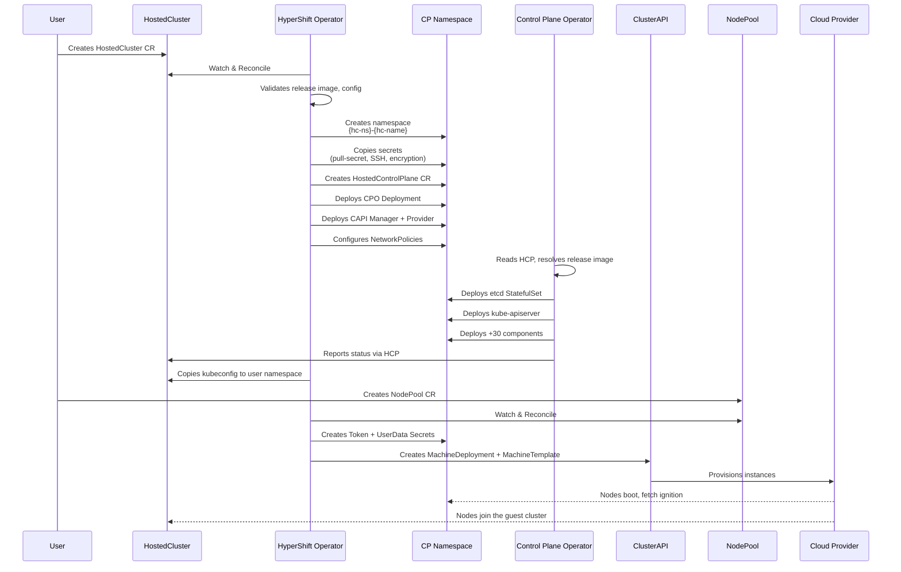

> **Explore yourself**: Follow the creation flow step by step in `hostedcluster_controller.go`:
>
> 1. `Reconcile()` (~line 337) - entry point
> 2. `reconcileHostedControlPlane()` (~line 2404) - HCP creation
> 3. `reconcileControlPlaneOperator()` - CPO deployment
> 4. `reconcileCAPIManager()` - CAPI deployment
> 5. Network policies: `hypershift-operator/controllers/hostedcluster/network_policies.go`

### 5.2 Steady State

- The CPO continuously reconciles all components against the HCP spec
- The PKI operator rotates certificates automatically
- The NodePool controller manages auto-repair and scaling
- Status flow: `CPO -> HCP status -> HO -> HC status`

### 5.3 Upgrade

> **See also**: [Upgrades](../how-to/upgrades.md) for detailed upgrade procedures and version skew policies.

Control plane and data plane upgrades are **decoupled**:

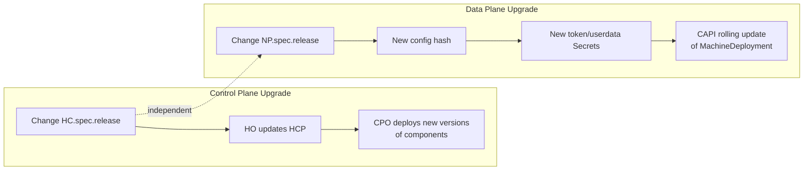

- `controlPlaneRelease`: allows patching management-side components without touching the data plane
- NodePool releases can be updated independently (within N-2 y-stream skew)

### 5.4 Deletion

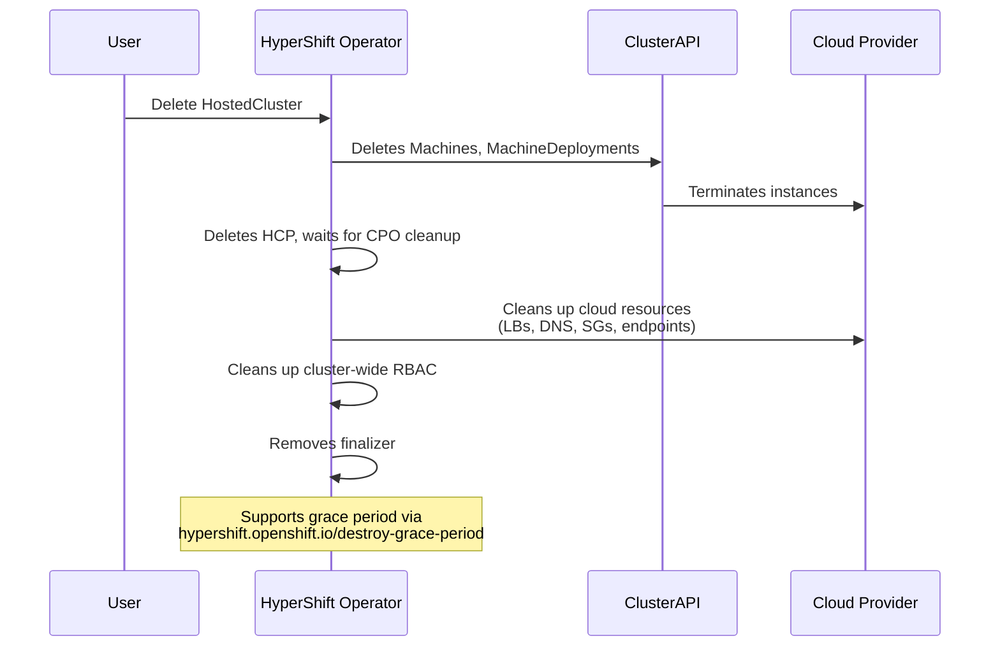

> **Explore yourself**: The deletion flow starts at `r.delete()` (~line 501 in `hostedcluster_controller.go`). Notice the `CloudResourcesDestroyed` and `HostedClusterDestroyed` conditions.

---

## 6. Control Plane in Detail

### 6.1 CPO Reconciliation Flow

> **See also**: [Controller Architecture](../reference/controller-architecture.md) for the full controller dependency graph and reconciliation details.

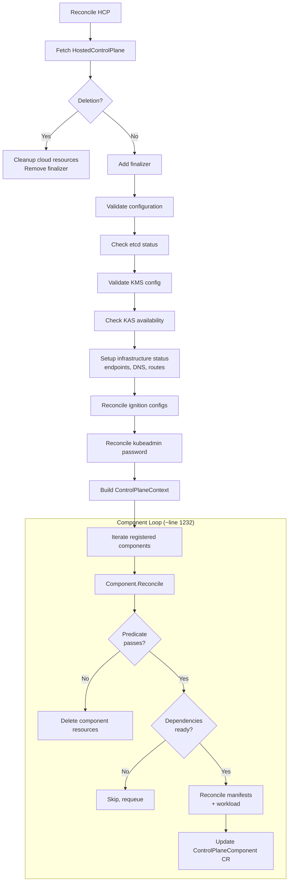

> **Explore yourself**: In `hostedcontrolplane_controller.go`, the component iteration loop is at ~line 1232:
> ```go
> for _, c := range r.components {
>     r.Log.Info("Reconciling component", "component_name", c.Name())
>     if err := c.Reconcile(cpContext); err != nil {
>         errs = append(errs, err)
>     }
> }
> ```

### 6.2 Component Dependencies

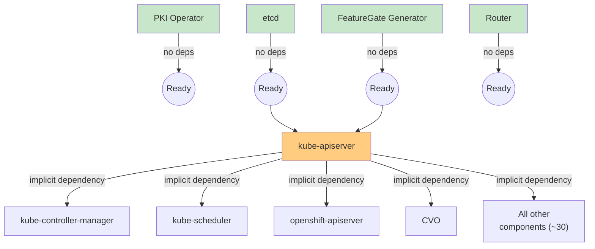

KAS is an implicit dependency for all components **except**: etcd, featuregate-generator, control-plane-operator, cluster-api, capi-provider, karpenter, and router. This logic is in `support/controlplane-component/status.go` at the `checkDependencies` function (~line 50).

### 6.3 Status Propagation

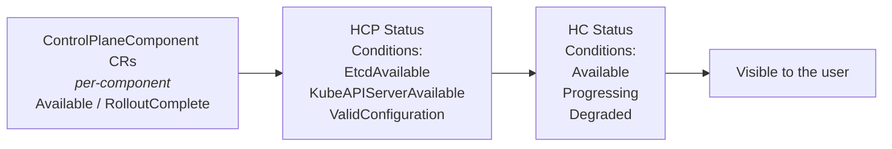

> **Explore yourself**:
>
> - HC conditions are defined in `api/hypershift/v1beta1/hostedcluster_conditions.go`
> - NP conditions are in `api/hypershift/v1beta1/nodepool_conditions.go`
> - The CPOv2 status logic is in `support/controlplane-component/status.go`

---

## 7. Data Plane and Node Management

> **See also**: [NodePool Rollouts](../reference/nodepool-rollouts.md) for in-depth rollout mechanics and update strategies.

### 7.1 NodePool - Key Fields

| Field | Purpose | Look at |
|-------|---------|---------|
| `spec.clusterName` | Immutable reference to the HostedCluster | `api/hypershift/v1beta1/nodepool_types.go` |
| `spec.release` | Release image (change triggers rollout, tagged `+rollout`) | Same file |
| `spec.platform` | Platform-specific machine config (AMI, instance type, etc.) | `aws.go`, `azure.go`, `kubevirt.go` in the api dir |
| `spec.replicas` / `spec.autoScaling` | Node count control | Same file |
| `spec.management.upgradeType` | `Replace` (default) or `InPlace` | Same file |
| `spec.management.autoRepair` | Enables MachineHealthCheck | Same file |
| `spec.config` | ConfigMap refs with MachineConfig (change triggers rollout) | Same file |

### 7.2 Node Lifecycle

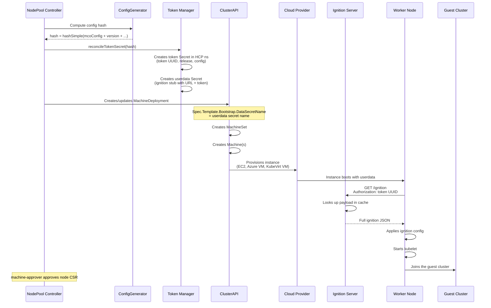

> **Explore yourself**: The NodePool controller is split across several files. Read them in this order:
>
> 1. `hypershift-operator/controllers/nodepool/nodepool_controller.go` - Main reconciler entry point, condition checks
> 2. `hypershift-operator/controllers/nodepool/config.go` - `ConfigGenerator`: how config hash is computed for rollout detection
> 3. `hypershift-operator/controllers/nodepool/token.go` - `Token`: token Secret and userdata Secret lifecycle
> 4. `hypershift-operator/controllers/nodepool/capi.go` - `CAPI`: MachineDeployment, MachineSet, MachineHealthCheck, MachineTemplate creation

### 7.3 ClusterAPI Integration

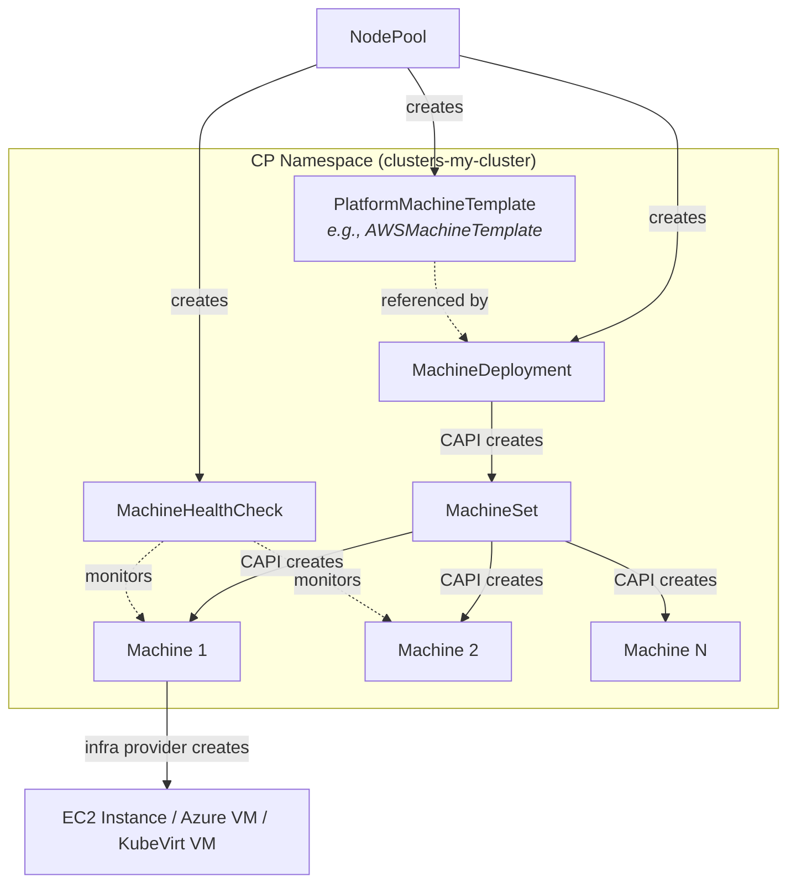

**Rollout detection**: `ConfigGenerator.Hash()` produces a new hash when config or version changes. New hash = new Secrets = new `DataSecretName` on MachineDeployment = CAPI rolling update.

> **Explore yourself**: Platform-specific machine template builders:
>
> - `hypershift-operator/controllers/nodepool/aws.go` - `awsMachineTemplateSpec()`: AMI resolution, instance type, root volume, security groups
> - `hypershift-operator/controllers/nodepool/azure.go` - Azure VM config
> - `hypershift-operator/controllers/nodepool/kubevirt/kubevirt.go` - KubeVirt VM config
> - `hypershift-operator/controllers/nodepool/agent.go` - Agent/bare-metal label selectors
> - `hypershift-operator/controllers/nodepool/gcp.go` - GCP machine config
> - `hypershift-operator/controllers/nodepool/openstack.go` - OpenStack config

### 7.4 Auto-scaling

> **See also**: [Resource-Based Control Plane Autoscaling](../how-to/resource-based-control-plane-autoscaling.md) for detailed autoscaling configuration.

- **Manual**: `nodePool.spec.replicas` propagates to `MachineDeployment.Spec.Replicas`
- **Cluster Autoscaler**: `nodePool.spec.autoScaling.min/max` becomes CAPI annotations on MachineDeployment
- **Scale-from-zero** (AWS only): capacity annotations (`vCPU`, `memoryMb`, `GPU`) in `hypershift-operator/controllers/nodepool/scale_from_zero.go`
- **Karpenter** (alternative): provisions nodes directly based on pending pods, bypassing MachineDeployments. See `karpenter-operator/controllers/`

> **Explore yourself**: Karpenter integration files:
>
> - `karpenter-operator/controllers/karpenter/karpenter_controller.go` - Main reconciler
> - `karpenter-operator/controllers/karpenterignition/karpenterignition_controller.go` - Ignition for Karpenter nodes
> - `api/karpenter/v1beta1/` - HyperShift Karpenter API types

### 7.5 Auto-repair

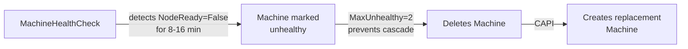

> **Explore yourself**: MHC creation is in `hypershift-operator/controllers/nodepool/capi.go`, function `reconcileMachineHealthCheck()` (~line 649). Note the different timeouts for cloud (8 min) vs Agent/None (16 min) platforms.

---

## 8. Supported Cloud Platforms

> **See also**: [Multi-Platform Support](../reference/multi-platform-support.md) for the platform support matrix and coupling rules. Platform-specific how-to guides are available under [How-to](../how-to/) for each cloud provider.

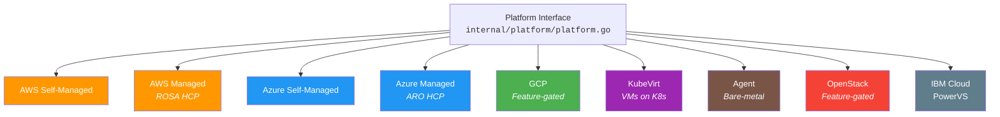

### Platform Interface

Every platform implements this interface (defined in `hypershift-operator/controllers/hostedcluster/internal/platform/platform.go`):

```go
type Platform interface {
    ReconcileCAPIInfraCR(...)       // Creates/updates the CAPI infrastructure CR
    CAPIProviderDeploymentSpec(...) // Provides the CAPI provider deployment spec
    ReconcileCredentials(...)       // Copies cloud credentials to CP namespace
    ReconcileSecretEncryption(...)  // Handles KMS-based encryption setup
    CAPIProviderPolicyRules()       // RBAC rules for the CAPI provider
    DeleteCredentials(...)          // Cleans up credentials on deletion
}
```

Platform dispatch happens in `GetPlatform()` (same file, ~line 91).

### Platform Comparison

| Aspect | AWS (Self-Managed) | AWS (ROSA HCP) | Azure (Self-Managed) | Azure (ARO HCP) | KubeVirt | Agent |
|--------|-------------------|----------------|---------------------|----------------|----------|-------|
| Managed service | No | Yes | No | Yes | - | - |
| CAPI Provider | CAPA | CAPA | CAPZ | CAPZ | CAPK | CAPAgent |
| Identity | OIDC + IAM Roles (STS) | OIDC + IAM Roles (STS) | Workload Identity | Managed Identity | In-cluster | N/A |
| KMS | AWS KMS | AWS KMS | Azure Key Vault | Azure Key Vault | - | - |
| Private connectivity | VPC PrivateLink | VPC PrivateLink | Azure Private Link | Azure Private Link | - | - |
| Infra provisioning | EC2, VPC, ELB | EC2, VPC, ELB | Azure VMs, VNet | Azure VMs, VNet | KubeVirt VMs | Pre-provisioned |
| Cloud Controller Manager | aws-ccm | aws-ccm | azure-ccm | azure-ccm | kubevirt-ccm | none |

> **Explore yourself**: Each platform implementation is in its own directory:
>
> - `hypershift-operator/controllers/hostedcluster/internal/platform/aws/aws.go`
> - `hypershift-operator/controllers/hostedcluster/internal/platform/azure/azure.go`
> - `hypershift-operator/controllers/hostedcluster/internal/platform/kubevirt/kubevirt.go`
> - `hypershift-operator/controllers/hostedcluster/internal/platform/agent/agent.go`
> - `hypershift-operator/controllers/hostedcluster/internal/platform/gcp/gcp.go`
> - `hypershift-operator/controllers/hostedcluster/internal/platform/openstack/openstack.go`
> - `hypershift-operator/controllers/hostedcluster/internal/platform/ibmcloud/ibmcloud.go`
> - `hypershift-operator/controllers/hostedcluster/internal/platform/powervs/powervs.go`

### AWS Infrastructure

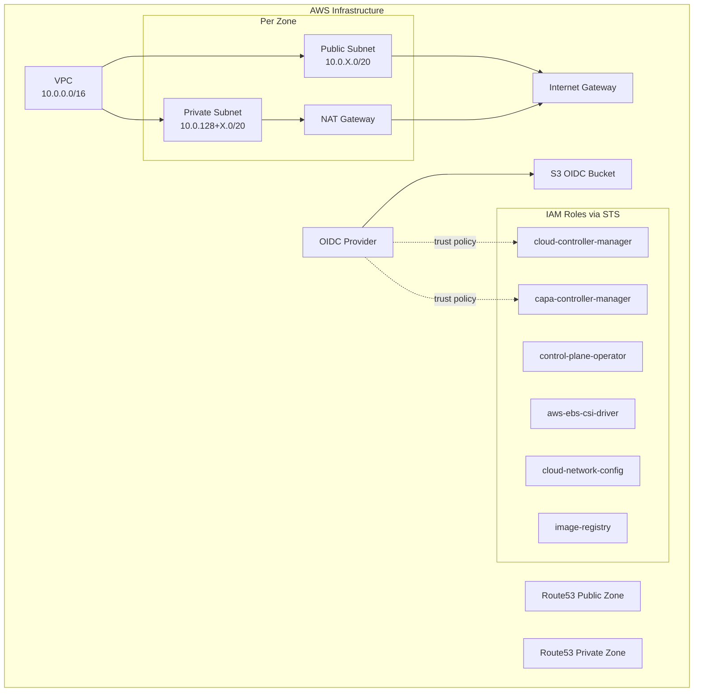

> **Explore yourself**: AWS infra provisioning CLI:
>
> - `cmd/infra/aws/create.go` - `CreateInfra()` orchestration (~line 191)
> - `cmd/infra/aws/ec2.go` - VPC, subnets, gateways, route tables
> - `cmd/infra/aws/iam.go` - IAM roles, OIDC provider, policy bindings
> - `cmd/infra/aws/create_iam.go` - IAM creation options
> - API: `api/hypershift/v1beta1/aws.go` - `AWSRolesRef` (line 512) for IAM role ARNs

### AWS PrivateLink

For private clusters, HyperShift manages VPC Endpoint Services:
- **HO side**: `hypershift-operator/controllers/platform/aws/controller.go` - `AWSEndpointServiceReconciler`
- **CPO side**: `control-plane-operator/controllers/awsprivatelink/awsprivatelink_controller.go` - Route53 records for private DNS

### KubeVirt - Nested Virtualization

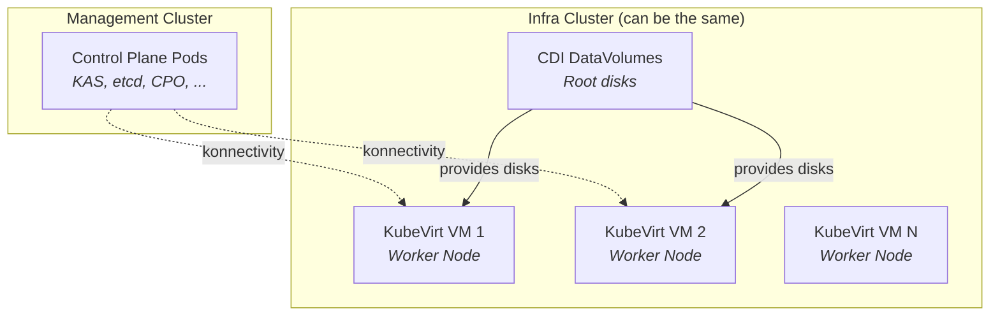

Key difference: when `KubevirtPlatformCredentials` is set, VMs can run on an **external infra cluster** separate from the management cluster.

> **Explore yourself**: KubeVirt cloud controller manager: `control-plane-operator/controllers/hostedcontrolplane/v2/cloud_controller_manager/kubevirt/`

### Cloud Controller Managers

Each platform's CCM is a CPOv2 component in:
`control-plane-operator/controllers/hostedcontrolplane/v2/cloud_controller_manager/<platform>/component.go`

> **Explore yourself**: Compare the AWS CCM (`aws/component.go`) with the KubeVirt CCM (`kubevirt/component.go`) to see how the component framework handles different platforms.

### Credential Management Pattern

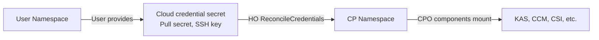

Cloud provider config generation files:
- `control-plane-operator/controllers/hostedcontrolplane/cloud/aws/providerconfig.go`
- `control-plane-operator/controllers/hostedcontrolplane/cloud/azure/providerconfig.go`
- `control-plane-operator/controllers/hostedcontrolplane/cloud/openstack/providerconfig.go`

---

## 9. APIs and Code Structure

### 9.1 Multi-Module Structure

```mermaid
graph TD
    subgraph "Root Module: github.com/openshift/hypershift"
        ROOT_MOD[go.mod]
        OPERATORS[hypershift-operator/<br/>control-plane-operator/<br/>karpenter-operator/]
        SUPPORT[support/]
        CMD[cmd/]
        VENDOR[vendor/<br/><i>DO NOT modify directly</i>]
    end

    subgraph "API Module: github.com/openshift/hypershift/api"
        API_MOD[api/go.mod]
        API_TYPES[api/hypershift/v1beta1/<br/>api/scheduling/v1alpha1/<br/>api/certificates/v1alpha1/<br/>api/karpenter/v1beta1/]
        API_VENDOR[api/vendor/]
    end

    OPERATORS -->|consumes via vendor| API_TYPES

    style VENDOR fill:#ffcdd2
    style API_VENDOR fill:#ffcdd2
```

> **GOLDEN RULE**: After any change in `api/`, run `make update`. This runs: `api-deps` -> `workspace-sync` -> `deps` -> `api` -> `api-docs` -> `clients` -> `docs-aggregate`.
> **Explore yourself**:
>
> - `api/go.mod` - the separate module definition
> - `api/CLAUDE.md` - API backward compatibility rules (critical reading!)
> - `hack/workspace/go.work` - Go workspace for local development across both modules

### 9.2 Main API Types

```mermaid
classDiagram
    class HostedCluster {
        +HostedClusterSpec spec
        +HostedClusterStatus status
        namespace: user namespace
        scope: user-facing
    }

    class HostedControlPlane {
        +HostedControlPlaneSpec spec
        +HostedControlPlaneStatus status
        namespace: CP namespace
        scope: internal
    }

    class NodePool {
        +NodePoolSpec spec
        +NodePoolStatus status
        namespace: user namespace
        scope: user-facing
    }

    class ControlPlaneComponent {
        +conditions: Available, RolloutComplete
        namespace: CP namespace
        scope: internal
    }

    HostedCluster "1" --> "1" HostedControlPlane : HC controller creates
    HostedCluster "1" --> "*" NodePool : clusterName reference
    HostedControlPlane "1" --> "*" ControlPlaneComponent : CPO creates

    NodePool --> MachineDeployment : CAPI
    MachineDeployment --> MachineSet : CAPI
    MachineSet --> Machine : CAPI
```

> **Explore yourself**: Key API files to read:
>
> - `api/hypershift/v1beta1/hostedcluster_types.go` - Start here. HostedClusterSpec (~line 529), HostedClusterStatus (~line 2105)
> - `api/hypershift/v1beta1/hosted_controlplane.go` - HCP spec (~line 44) mirrors HC spec
> - `api/hypershift/v1beta1/nodepool_types.go` - NodePoolSpec, note the `+rollout` tags
> - `api/hypershift/v1beta1/controlplanecomponent_types.go` - CPOv2 status tracking
> - `api/hypershift/v1beta1/etcdbackup_types.go` - Example of a feature-gated type
> - `api/hypershift/v1beta1/groupversion_info.go` - API group registration

### 9.3 Feature Gates

Feature gates control which API fields and CRD types are available:

```go
// Example: gated field
// +openshift:enable:FeatureGate=AutoNodeKarpenter
AutoNode *AutoNode `json:"autoNode,omitempty"`
```

> **Explore yourself**: Feature gate definitions are in `api/hypershift/v1beta1/featuregates/`:
>
> - `featureGate-Hypershift-Default.yaml` - Default feature set
> - `featureGate-Hypershift-TechPreviewNoUpgrade.yaml` - TechPreview set
> - Per-gate CRD fragments are generated in `api/hypershift/v1beta1/zz_generated.featuregated-crd-manifests/`

### 9.4 Key Annotations

Some important annotations you'll encounter (defined in `api/hypershift/v1beta1/hostedcluster_types.go`, lines 29-449):

| Annotation | Purpose |
|-----------|---------|
| `hypershift.openshift.io/control-plane-operator-image` | Override CPO image (dev/e2e) |
| `hypershift.openshift.io/restart-date` | Triggers rolling restart of all components |
| `hypershift.openshift.io/force-upgrade-to` | Force upgrade even if CVO says not upgradeable |
| `hypershift.openshift.io/disable-pki-reconciliation` | Stops PKI cert regeneration |
| `resource-request-override.hypershift.openshift.io/<deploy>.<container>` | Override resource requests per container |
| `hypershift.openshift.io/topology` | `dedicated-request-serving-components` for dedicated nodes |
| `hypershift.openshift.io/cleanup-cloud-resources` | Controls cloud resource cleanup on deletion |

> **Explore yourself**: Read the annotation constants block at the top of `hostedcluster_types.go` (lines 29-449). Each has a comment explaining its purpose.

---

## 10. Development Workflow

> **See also**: [Run Tests](../contribute/run-tests.md), [Run HyperShift Operator Locally](../contribute/run-hypershift-operator-locally.md), and [Develop In-Cluster](../contribute/develop_in_cluster.md) for detailed development setup guides.

### 10.1 Essential Commands

```bash
# Build
make build                    # All binaries
make hypershift               # CLI only
make hypershift-operator      # HO only
make control-plane-operator   # CPO only

# Test
make test                     # Unit tests with race detection
make e2e                      # Build E2E test binaries

# Code quality
make verify                   # Full verification (BEFORE PR) - includes generate, fmt, vet, lint, codespell, gitlint
make lint                     # golangci-lint
make lint-fix                 # Auto-fix linting
make fmt                      # Format
make vet                      # go vet

# API and generation
make update                   # Full update after api/ changes
make api                      # Only regenerate CRDs
make generate                 # go generate
make clients                  # Update generated clients
```

### 10.2 Workflow for API Changes

```mermaid
flowchart TD
    A[Edit types in api/hypershift/v1beta1/] --> B[make update]
    B --> C[make verify]
    C --> D{Changed a field type?}
    D -->|Yes| E[Add serialization compatibility test<br/>in *_types_test.go]
    D -->|No| F[make test]
    E --> F
    F --> G[Create PR]
```

> **Explore yourself**: Look at `api/hypershift/v1beta1/nodepool_types_test.go` for the serialization compatibility test pattern. It defines an N-1 struct and verifies JSON round-trip compatibility.

### 10.3 Running Locally

```bash
# Install HyperShift in development mode
make hypershift-install-aws-dev

# Run operator locally
make run-operator-locally-aws-dev

# Or manually
bin/hypershift install --development
bin/hypershift-operator run
```

> **Explore yourself**: The CLI is built from `main.go` at the repo root. Subcommands are in `cmd/`:
>
> - `cmd/cluster/` - `create cluster` and `destroy cluster` commands
> - `cmd/nodepool/` - `create nodepool` and `destroy nodepool`
> - `cmd/install/` - `install` command and CRD assets
> - `cmd/infra/` - `create infra` commands per platform
> - `cmd/install/assets/hypershift-operator/` - Final CRD YAML files

---

## 11. Common Development Patterns

### 11.1 Upsert Pattern

`support/upsert/upsert.go` wraps `controllerutil.CreateOrUpdate` to prevent reconciliation loops by copying server-defaulted fields.

```go
// Typical usage in a reconciler
result, err := r.createOrUpdate(ctx, r.client, deployment, func() error {
    // mutate deployment here
    return nil
})
```

> **Explore yourself**: Read `support/upsert/upsert.go` to understand the loop detection mechanism. The `CreateOrUpdateProvider` interface is injected into controllers via `SetupWithManager`.

### 11.2 Controller Structure

```go
type MyReconciler struct {
    client         crclient.Client
    createOrUpdate upsert.CreateOrUpdateFN
}

func (r *MyReconciler) Reconcile(ctx context.Context, req ctrl.Request) (ctrl.Result, error) {
    // 1. Fetch resource
    // 2. Handle deletion
    // 3. Add finalizer
    // 4. Reconcile sub-resources
    // 5. Update status
}
```

> **Explore yourself**: Compare how different controllers are set up:
>
> - `hypershift-operator/controllers/hostedcluster/hostedcluster_controller.go` - Large, complex controller
> - `hypershift-operator/controllers/hostedclustersizing/hostedclustersizing_controller.go` - Simpler controller
> - `control-plane-operator/controllers/hostedcontrolplane/hostedcontrolplane_controller.go` - CPO main controller

### 11.3 Test Conventions

- Use **Gherkin syntax** for test names: `"When ... it should ..."`
- Use **gomega** for assertions
- Unit tests live alongside source files
- E2E tests in `test/e2e/`
- Integration tests in `test/integration/`

> **Explore yourself**:
>
> - `test/e2e/` - E2E tests covering cluster lifecycle, nodepool operations, upgrades
> - `test/integration/` - Integration tests for controller behavior
> - Any `*_test.go` file alongside the source for unit test examples

### 11.4 API Backward Compatibility

Rules from `api/CLAUDE.md`:
- Every API type change must be safe for **N+1 (forward)** and **N-1 (rollback)** compatibility
- Changing a value type to a pointer (e.g., `int32` to `*int32`) requires `omitempty`
- Never remove or rename fields
- Always add serialization compatibility tests when modifying field types

---

## 12. Architectural Invariants

> **See also**: [Goals and Design Invariants](../reference/goals-and-design-invariants.md) for the authoritative list of project goals and invariants.

These are the design rules that should inform **every decision**:

1. **Unidirectional communication**: Management cluster -> hosted cluster, never the reverse. All communication originates from within the CP namespace.

2. **Pristine workers**: Compute nodes run only user workloads + minimal agents (kubelet, konnectivity-agent, CNI). No control plane logic.

3. **No mutable CRDs/CRs exposed**: The hosted cluster should not expose mutable resources that could interfere with HyperShift-managed features.

4. **Data plane changes do not trigger management-side lifecycle actions**: Prevents cascading failures.

5. **No user credential management**: HyperShift components do not own credentials; they copy and use them, but ownership remains with the user.

6. **Namespace isolation**: Each CP namespace is isolated via NetworkPolicies and Linux container primitives. See `hypershift-operator/controllers/hostedcluster/network_policies.go`.

7. **Decoupled upgrade signals**: Management-side and data-plane components upgrade independently via `controlPlaneRelease`.

8. **CPO backward compatibility**: The HO may deploy older CPO versions. Changes to the HO must consider impact on older CPOs. The HO checks CPO image labels before enabling features (e.g., `controlPlanePKIOperatorSignsCSRs`, `useRestrictedPSA`, `defaultToControlPlaneV2`).

---

## 13. Key File Reference

### APIs

| File | Contents | Priority |
|------|----------|----------|
| `api/hypershift/v1beta1/hostedcluster_types.go` | HostedCluster spec/status, platform configs, constants, annotations | Must read |
| `api/hypershift/v1beta1/hostedcluster_conditions.go` | HC condition type constants | Must read |
| `api/hypershift/v1beta1/hosted_controlplane.go` | HostedControlPlane spec/status | Must read |
| `api/hypershift/v1beta1/nodepool_types.go` | NodePool spec/status | Must read |
| `api/hypershift/v1beta1/nodepool_conditions.go` | NP condition type constants | Must read |
| `api/hypershift/v1beta1/aws.go` | AWS types (`AWSPlatformSpec`, `AWSRolesRef`) | Read for AWS work |
| `api/hypershift/v1beta1/azure.go` | Azure types | Read for Azure work |
| `api/hypershift/v1beta1/kubevirt.go` | KubeVirt types | Read for KubeVirt work |
| `api/hypershift/v1beta1/controlplanecomponent_types.go` | CPOv2 ControlPlaneComponent CR | Good to know |
| `api/hypershift/v1beta1/etcdbackup_types.go` | Feature-gated type example | Good to know |
| `api/hypershift/v1beta1/groupversion_info.go` | API group registration | Reference |
| `api/CLAUDE.md` | API compatibility rules | Must read |

### HO Controllers

| File | Contents | Priority |
|------|----------|----------|
| `hypershift-operator/controllers/hostedcluster/hostedcluster_controller.go` | HC Reconciler (~5200 lines) | Must read (selectively) |
| `hypershift-operator/controllers/hostedcluster/network_policies.go` | Namespace isolation NetworkPolicies | Good to know |
| `hypershift-operator/controllers/nodepool/nodepool_controller.go` | NP Reconciler main entry | Must read |
| `hypershift-operator/controllers/nodepool/config.go` | ConfigGenerator, rollout hash | Must read |
| `hypershift-operator/controllers/nodepool/token.go` | Token and UserData Secrets | Must read |
| `hypershift-operator/controllers/nodepool/capi.go` | MachineDeployment, MHC, templates | Must read |
| `hypershift-operator/controllers/nodepool/aws.go` | AWS MachineTemplate builder | Read for AWS work |
| `hypershift-operator/controllers/nodepool/azure.go` | Azure MachineTemplate builder | Read for Azure work |
| `hypershift-operator/controllers/nodepool/kubevirt/kubevirt.go` | KubeVirt MachineTemplate builder | Read for KubeVirt work |
| `hypershift-operator/controllers/nodepool/conditions.go` | SetStatusCondition helpers | Reference |
| `hypershift-operator/controllers/nodepool/version.go` | NodesInfo aggregation from CAPI Machines | Reference |
| `hypershift-operator/controllers/nodepool/scale_from_zero.go` | Scale-from-zero annotation management | Reference |
| `hypershift-operator/controllers/manifests/manifests.go` | Namespace naming, resource naming helpers | Reference |

### CPO Controllers

| File | Contents | Priority |
|------|----------|----------|
| `control-plane-operator/controllers/hostedcontrolplane/hostedcontrolplane_controller.go` | HCP Reconciler (~3200 lines) | Must read (selectively) |
| `control-plane-operator/controllers/hostedcontrolplane/v2/kas/` | kube-apiserver component (complex example) | Good to know |
| `control-plane-operator/controllers/hostedcontrolplane/v2/kube_scheduler/` | kube-scheduler component (simple example) | Must read |
| `control-plane-operator/controllers/hostedcontrolplane/v2/etcd/` | etcd component | Good to know |
| `control-plane-operator/controllers/hostedcontrolplane/v2/capi_manager/` | CAPI manager component | Reference |
| `control-plane-operator/controllers/hostedcontrolplane/v2/capi_provider/` | CAPI provider component | Reference |
| `control-plane-operator/controllers/hostedcontrolplane/v2/cloud_controller_manager/` | Per-platform CCMs | Read per platform |
| `control-plane-operator/controllers/hostedcontrolplane/v2/assets/` | YAML manifests for all components | Reference |

### Framework and Support

| File | Contents | Priority |
|------|----------|----------|
| `support/controlplane-component/controlplane-component.go` | CPOv2 framework core | Must read |
| `support/controlplane-component/builder.go` | Builder pattern for components | Must read |
| `support/controlplane-component/status.go` | Status logic, dependency checking | Must read |
| `support/controlplane-component/workload.go` | Workload reconciliation | Good to know |
| `support/upsert/upsert.go` | CreateOrUpdate wrapper | Must read |

### Platform Implementations

| File | Contents | Priority |
|------|----------|----------|
| `hypershift-operator/controllers/hostedcluster/internal/platform/platform.go` | Platform interface definition | Must read |
| `hypershift-operator/controllers/hostedcluster/internal/platform/aws/aws.go` | AWS platform impl | Read for AWS |
| `hypershift-operator/controllers/hostedcluster/internal/platform/azure/azure.go` | Azure platform impl | Read for Azure |
| `hypershift-operator/controllers/hostedcluster/internal/platform/kubevirt/kubevirt.go` | KubeVirt platform impl | Read for KubeVirt |
| `hypershift-operator/controllers/hostedcluster/internal/platform/agent/agent.go` | Agent platform impl | Read for Agent |

### PKI and Ignition

| File | Contents | Priority |
|------|----------|----------|
| `control-plane-pki-operator/operator.go` | PKI operator wiring | Good to know |
| `control-plane-pki-operator/certrotationcontroller/` | Certificate rotation | Reference |
| `control-plane-pki-operator/certificatesigningcontroller/` | CSR signing | Reference |
| `ignition-server/cmd/start.go` | Ignition HTTPS server | Good to know |
| `ignition-server/controllers/tokensecret_controller.go` | Token reconciler | Good to know |
| `ignition-server/controllers/local_ignitionprovider.go` | MCO binary execution | Reference |

### CLI and Infrastructure

| File | Contents | Priority |
|------|----------|----------|
| `main.go` | CLI entry point | Reference |
| `cmd/cluster/` | create/destroy cluster commands | Reference |
| `cmd/nodepool/` | create/destroy nodepool commands | Reference |
| `cmd/install/` | install command, CRD assets | Reference |
| `cmd/infra/aws/create.go` | AWS infra CLI (`CreateInfra()`) | Read for AWS |
| `cmd/infra/aws/iam.go` | AWS IAM roles and OIDC | Read for AWS |
| `cmd/infra/azure/` | Azure infra CLI | Read for Azure |

### Tests

| File | Contents | Priority |
|------|----------|----------|
| `test/e2e/` | E2E tests (cluster lifecycle, nodepool, upgrades) | Browse for context |
| `test/integration/` | Integration tests (controller behavior) | Browse for context |
| `api/hypershift/v1beta1/nodepool_types_test.go` | Serialization compatibility test example | Must read for API changes |

---

## 14. Recommended Learning Path

```mermaid
graph TD
    subgraph "Week 1-2: Foundations"
        S1A[Read this document end-to-end]
        S1B[Install HyperShift locally<br/><code>make hypershift-install-aws-dev</code>]
        S1C[Create a test HostedCluster<br/><code>bin/hypershift create cluster</code>]
        S1D[Explore the CRDs:<br/>HostedCluster, HCP, NodePool<br/><i>Read the API type files</i>]
        S1E[Observe pods in the<br/>CP namespace with kubectl]
    end

    subgraph "Week 3-4: Architecture"
        S2A[Read hostedcluster_controller.go<br/>Understand the reconcile loop]
        S2B[Read hostedcontrolplane_controller.go<br/>Understand how the CPO<br/>deploys components]
        S2C[Read nodepool_controller.go<br/>Understand the node flow]
        S2D[Study the CPOv2 framework<br/>support/controlplane-component/]
        S2E[Read a simple v2 component<br/>e.g., kube-scheduler]
    end

    subgraph "Week 5-6: Deep Dive"
        S3A[Study the Platform interface<br/>and one implementation<br/>e.g., AWS or KubeVirt]
        S3B[Understand the ignition flow<br/>Token -> Ignition Server -> Node]
        S3C[Study PKI and certificates]
        S3D[Make a real change:<br/>bug fix or small feature]
        S3E[Run make verify<br/>and create your first PR]
    end

    subgraph "Week 7+: Specialization"
        S4A[Choose area of focus:<br/>- Control Plane<br/>- Data Plane / NodePool<br/>- Platform specific<br/>- API Design]
        S4B[Read E2E tests<br/>test/e2e/]
        S4C[Contribute features<br/>and PR reviews]
    end

    S1A --> S1B --> S1C --> S1D --> S1E
    S1E --> S2A
    S2A --> S2B --> S2C --> S2D --> S2E
    S2E --> S3A
    S3A --> S3B --> S3C --> S3D --> S3E
    S3E --> S4A --> S4B --> S4C
```

### Suggested Reading Order for Code

For each area, follow this order to build understanding incrementally:

**Control Plane path:**
1. `api/hypershift/v1beta1/hostedcluster_types.go` (skim the Spec, focus on key fields)
2. `api/hypershift/v1beta1/hosted_controlplane.go` (note the similarity to HC)
3. `hypershift-operator/controllers/hostedcluster/hostedcluster_controller.go` (`Reconcile` method only)
4. `control-plane-operator/controllers/hostedcontrolplane/hostedcontrolplane_controller.go` (`Reconcile` and `registerComponents`)
5. `support/controlplane-component/controlplane-component.go` (core framework)
6. `control-plane-operator/controllers/hostedcontrolplane/v2/kube_scheduler/` (simple component)

**Data Plane path:**
1. `api/hypershift/v1beta1/nodepool_types.go`
2. `hypershift-operator/controllers/nodepool/nodepool_controller.go` (`Reconcile` entry point)
3. `hypershift-operator/controllers/nodepool/config.go` (hash-based rollout)
4. `hypershift-operator/controllers/nodepool/token.go` (ignition tokens)
5. `hypershift-operator/controllers/nodepool/capi.go` (CAPI resource creation)
6. `ignition-server/cmd/start.go` (how nodes fetch their config)

**Platform path (pick one):**
1. `hypershift-operator/controllers/hostedcluster/internal/platform/platform.go` (interface)
2. `hypershift-operator/controllers/hostedcluster/internal/platform/<your-platform>/` (implementation)
3. `hypershift-operator/controllers/nodepool/<your-platform>.go` (machine template)
4. `control-plane-operator/controllers/hostedcontrolplane/v2/cloud_controller_manager/<your-platform>/` (CCM)
5. `api/hypershift/v1beta1/<your-platform>.go` (API types)

### Tips for New Team Members

1. **Start with the CRDs**: Understanding `HostedCluster`, `HostedControlPlane`, and `NodePool` is 80% of the work
2. **Follow the data flow**: HC -> HCP -> Components. NP -> CAPI -> Cloud -> Node
3. **Conditions are your friend**: Always check `.status.conditions` to understand what's happening
4. **`make verify` before pushing**: Always
5. **The CP namespace is where the magic happens**: `kubectl get pods -n clusters-<name>` shows you everything
6. **Read the tests**: Unit tests and E2E tests are the best living documentation
7. **Use `hypershift dump`**: The diagnostic tool at `cmd/dump/` captures full cluster state for debugging
8. **Don't read 5000-line files end-to-end**: Follow function calls from the `Reconcile` entry point
9. **The API module is separate**: Remember to run `make update` after any change in `api/`
10. **Ask about invariants**: When in doubt about a design decision, check if it violates any of the [architectural invariants](#12-architectural-invariants)
